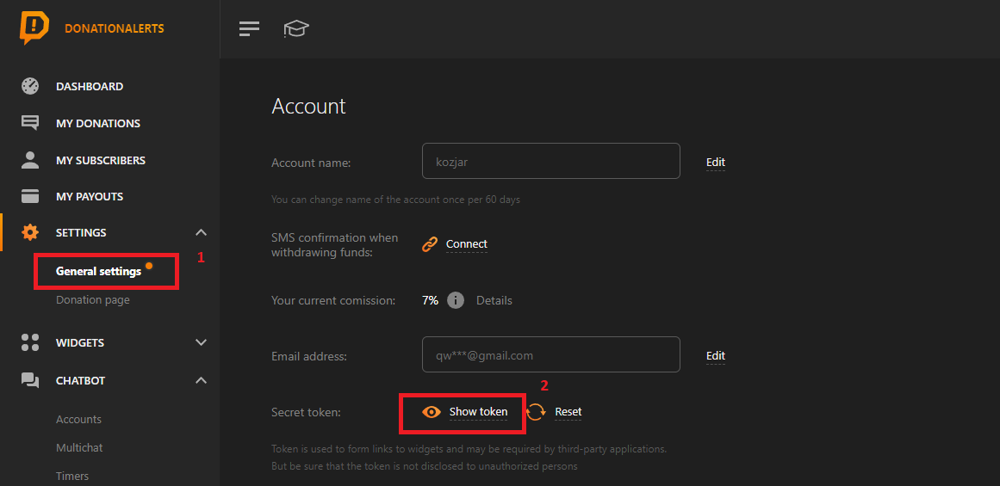

<h1 align="center">Twitch Subathon Countdown Template</h1>

This is the template I created for my Twitch Subathon Countdowns

 

<h2>Description</h2>

A subathon timer that increases when someone subscribes, donates money, donates bits or purchases streamloots chests.

 

<h2>Preview</h2>
<h3 align="center"></h3>
 

<h2>Usage</h2>

After cloning this repository you'll have to edit the "config.js" file with any plain text editor, then change the value of the variables according to what you want:

<h3>Streamlabs Token</h3>

To get the token you'll have to go to the general settings tab of your <a href="https://www.donationalerts.com/dashboard/general">Donation Alerts dashboard</a> then click Show token and  paste the code on the "donationAlertsToken" variable in the "config.js" file.

<h3>Initial Time</h3>

You can set the initial time of the timer by setting the hours, minutes and seconds to be added when the timer is created.

<h3>Add To OBS</h3>

To add it to OBS you just have to open application and show it as any regular app.

<h2>Hotkeys</h2>

- "R" - reset time to initial
- Arrow UP - increase time
- Arrow DOWN - decrease time
- Space - pause timer